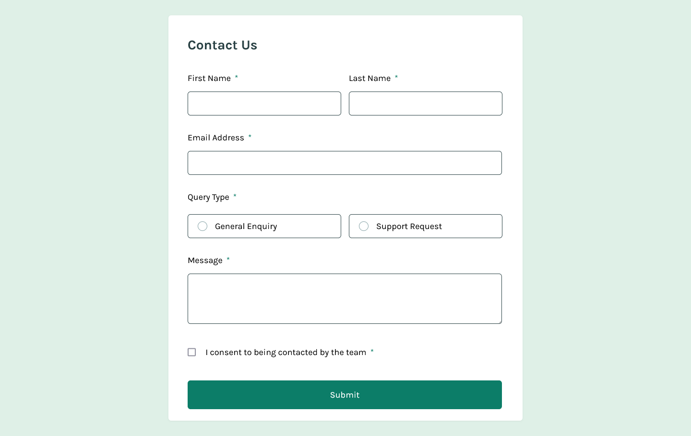
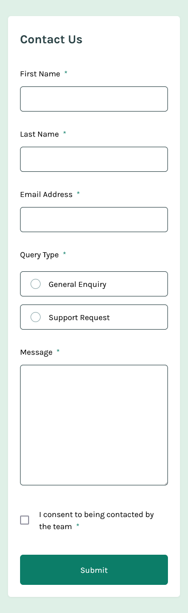

# Frontend Mentor - Contact form solution

This is a solution to the [Contact form challenge on Frontend Mentor](https://www.frontendmentor.io/challenges/contact-form--G-hYlqKJj). Frontend Mentor challenges help you improve your coding skills by building realistic projects.

## Table of contents

- [Overview](#overview)
  - [The challenge](#the-challenge)
  - [Screenshot](#screenshot)
  - [Links](#links)
- [My process](#my-process)
  - [Built with](#built-with)
  - [What I learned](#what-i-learned)
  - [Continued development](#continued-development)
  - [Useful resources](#useful-resources)
- [Author](#author)
- [Acknowledgments](#acknowledgments)

## Overview

### The challenge

Users should be able to:

- Complete the form and see a success toast message upon successful submission
- Receive form validation messages if:
  - A required field has been missed
  - The email address is not formatted correctly
- Complete the form only using their keyboard
- Have inputs, error messages, and the success message announced on their screen reader
- View the optimal layout for the interface depending on their device's screen size
- See hover and focus states for all interactive elements on the page

### Screenshot

- Desktop version.
  

- Mobile version.
  

### Links

- Solution URL: [Source code on Github](https://github.com/Abaljerind/contact-form-main)
- Live Site URL: [Contact Form Main](https://contact-form-main-omega.vercel.app/)

## My process

### Built with

- Semantic HTML5 markup
- Flexbox
- Mobile-first workflow
- [TailwindCSS](https://tailwindcss.com/) - For styles

### What I learned

Using this CSS combined with TailwindCSS I can make a label look like an input and give it a different color like in the design. And for the JS code, I'm making sure that once the user finish input their contact information, the browser will send the data to the server manually using submit function.

```html
<h1>Some codes I'm proud of</h1>
```

```css
.radio-group label {
  @apply relative flex h-[50px] w-[295px] cursor-pointer select-none items-center rounded-md border border-grey-xl bg-inherit pl-14 hover:border-green-md sm:w-[320px];
}

.radio-group input[type="radio"]:checked + label {
  @apply border-green-md bg-green-sm;
}

.radio-group label::before {
  @apply absolute left-5 top-1/2 h-5 w-5 -translate-y-1/2 rounded-full border border-grey-md bg-white content-[""];
}

.radio-group input[type="radio"]:checked + label::before {
  @apply border-2 border-green-md bg-white;
}

.radio-group input[type="radio"]:checked + label::after {
  @apply absolute left-6 top-1/2 h-3 w-3 -translate-y-1/2 rounded-full bg-green-md content-[""];
}
```

```js
if (isValid) {
  successState.classList.remove("hidden");

  setTimeout(() => {
    successState.classList.remove("animate-fade-in");
    successState.classList.add("animate-fade-out");
  }, 3000);

  setTimeout(() => {
    successState.classList.add("hidden");

    contactForm.submit();
  }, 5000);
}
```

If you want more help with writing markdown, we'd recommend checking out [The Markdown Guide](https://www.markdownguide.org/) to learn more.

**Note: Delete this note and the content within this section and replace with your own learnings.**

### Continued development

For future development, I want to make sure this website can send the data to my server.

### Useful resources

- [TailwindCSS](https://tailwindcss.com/) - This helped me to do the styling more easy. I really liked this tailwind css and will use it going forward.
- [Vercel](https://vercel.com) - This is an amazing website which helped me to upload my website into the internet. I'd recommend it to anyone still learning to use this website.

## Author

- Website - [AbalJerind](https://contact-form-main-omega.vercel.app/)
- Frontend Mentor - [@Abaljerind](https://www.frontendmentor.io/profile/Abaljerind)

## Acknowledgments

I want to thank me for believing in me, I want to thank me for doing all this hard work. I wanna thank me for having no days off. I wanna thank me for never quitting. I wanna thank me for being me at all times.
